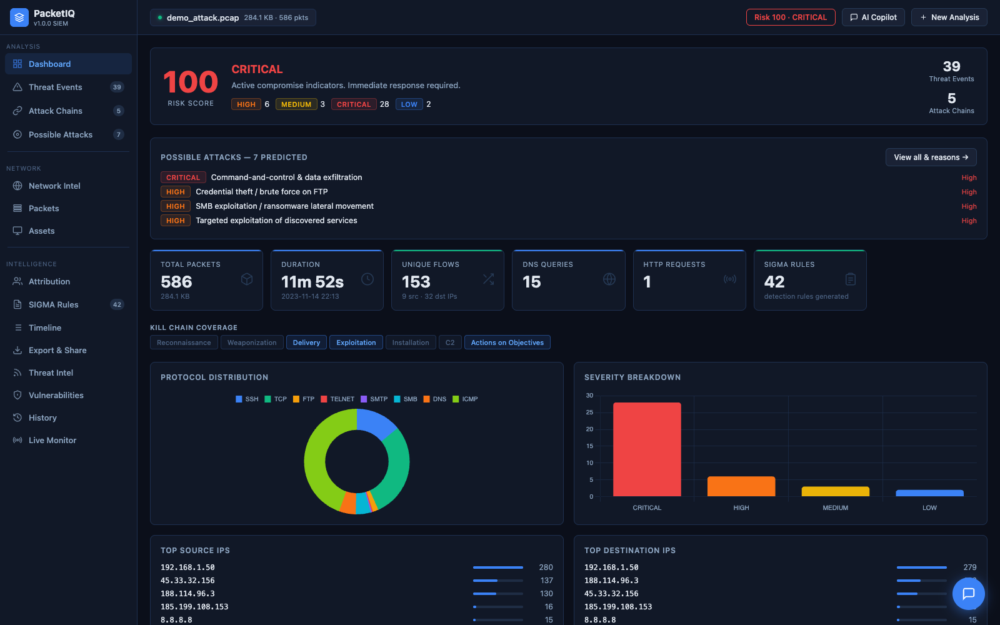
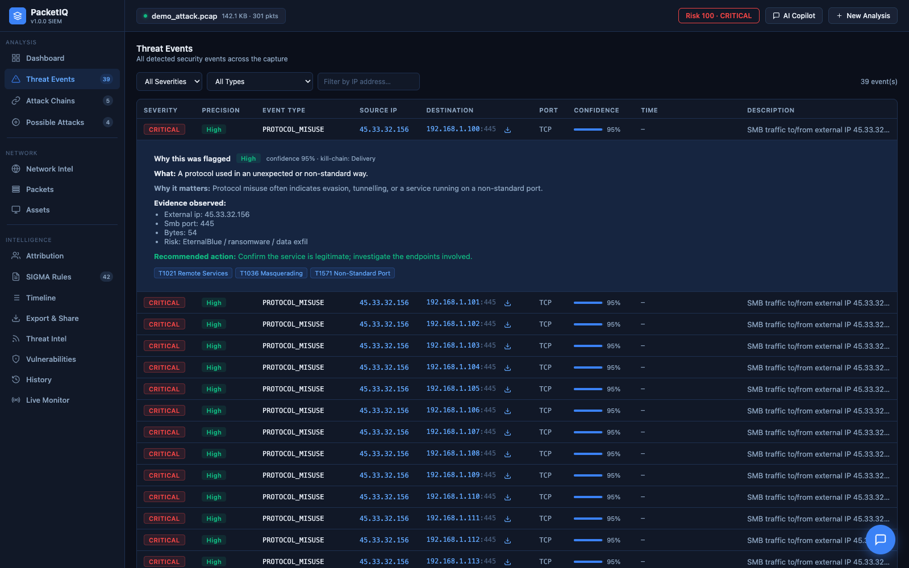
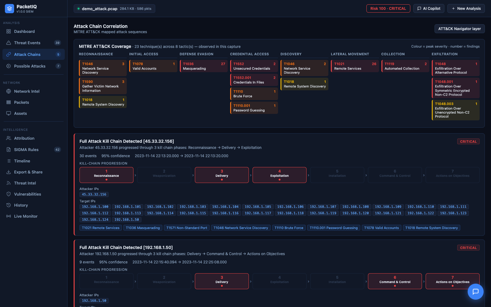
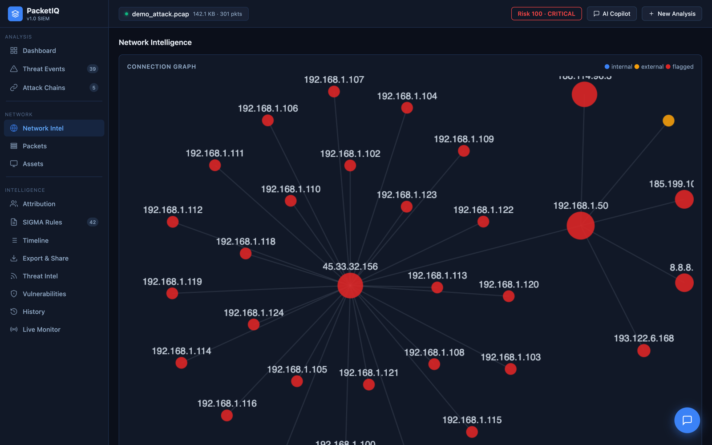
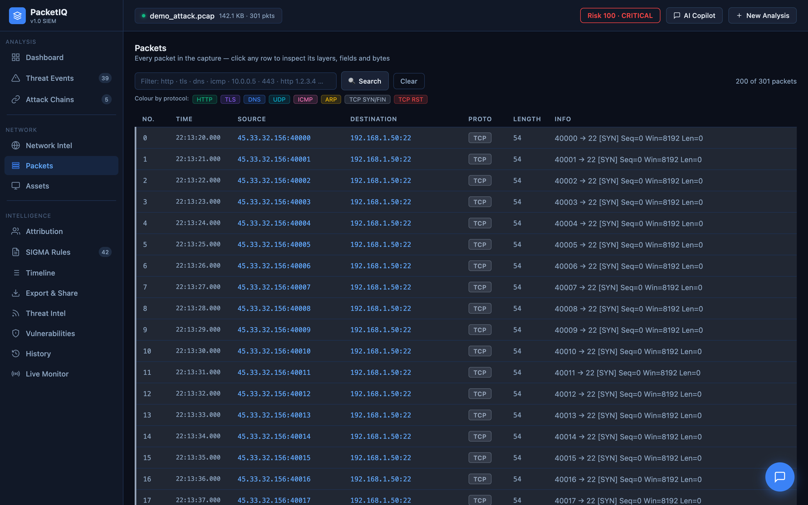
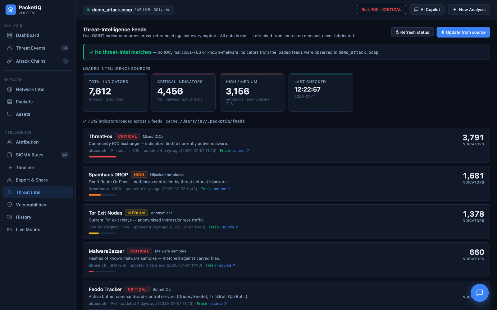
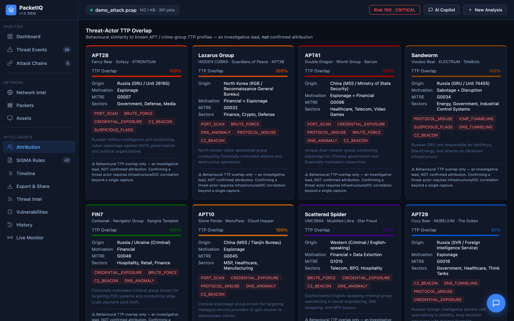
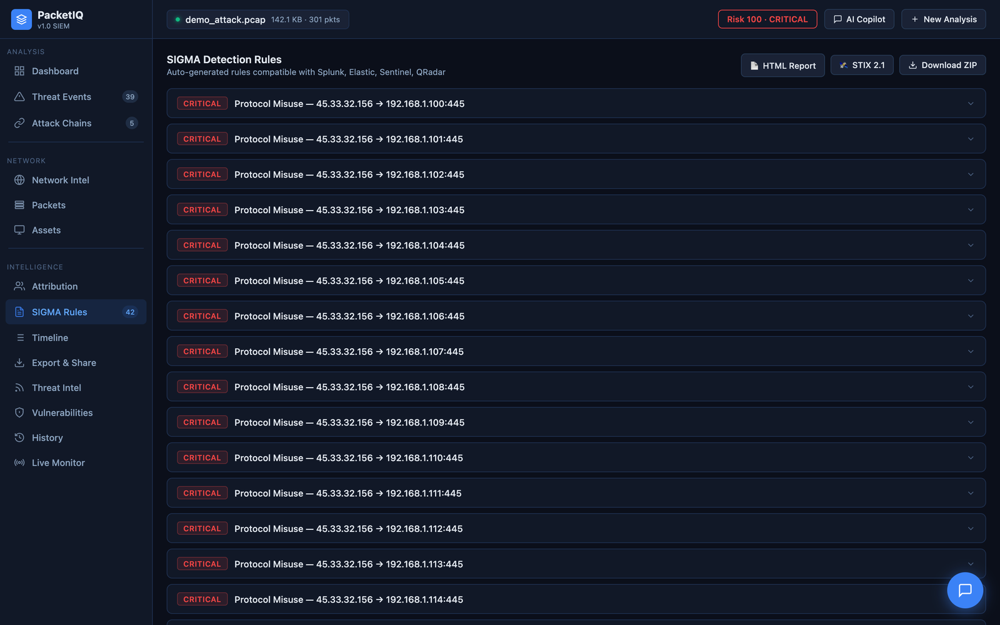
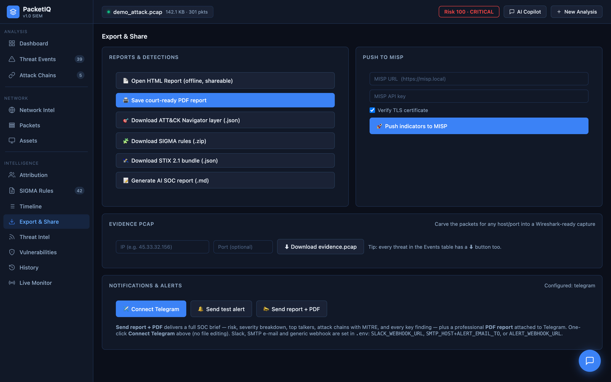

<div align="center">

  


<a href="https://github.com/PacketIQ">
  
</a>

<br/><br/>


<br/>

[**Why PacketIQ**](#-why-packetiq) ·
[**Quick Start**](#-quick-start) ·
[**Detectors**](#-detection-capabilities) ·
[**Threat Intel**](#-threat-intelligence) ·
[**CLI**](#-cli-reference) ·
[**Web UI**](#-web-interface) ·
[**Integrations**](#-integrations--exports) ·
[**Architecture**](#-architecture) ·
[**Config**](#-configuration)

<br/><br/>



<sub>⬆︎ <i>The live web app analysing a capture. <b>Every screenshot in this README is the real running app</b> — nothing mocked, nothing staged.</i></sub>

<br/><br/>

**`100%` recall** · **`90%` precision** on real CTU-13 malware · **`15`** detection types · **`7,600+`** live threat-intel indicators · **`724`** tests · **`ruff`-clean**

</div>

---

## 📡 What is PacketIQ?

**PacketIQ** is a defensive network-forensics platform for SOC analysts, threat hunters and incident responders. Feed it a packet capture (`.pcap` / `.pcapng` / `.cap`), a **Zeek `conn.log`**, a **NetFlow / IPFIX export**, or a **live interface**, and it produces a complete, evidence-backed analysis:

- **15 detection types** (across 12 detector modules) spanning recon, brute force, C2 beaconing, DNS/ICMP tunneling, credential exposure, TLS fingerprinting, file transfers and HTTP exploitation
- **Real threat-intel enrichment** — every IP and domain is checked against real OSINT feeds (abuse.ch, Tor, Spamhaus) bundled as dated snapshots and refreshable with `packetiq feeds update`
- **Attack-chain correlation** with **MITRE ATT&CK** and Lockheed-Martin kill-chain mapping
- **Deployable detections** — pySigma-valid SIGMA rules, STIX 2.1 bundles, MISP push, evidence PCAP slices
- **Three interfaces** — a rich terminal UI, a real-time FastAPI web app, and a local dashboard
- **An optional AI SOC copilot** (Gemini / Groq / Claude) that answers questions about the capture

> [!IMPORTANT]
> **Built to be real, not flashy.** Threat-intel matches come from *actual* abuse.ch/Tor/Spamhaus feeds bundled in the repo — no invented hashes or IOCs. Threat-actor output is framed as **behavioural TTP overlap, not confirmed attribution**. The core analysis runs **fully offline**; AI is optional. No detector is perfect — always validate findings against the raw capture.

---

## 🎬 See It In Action

<div align="center"><sub>A guided tour of the browser app analysing the bundled <code>samples/demo_attack.pcap</code> — real screenshots, not mockups.</sub></div>

<br/>

<table>
<tr>
<td width="50%" valign="top">

<b>🔍 Threat Events → “Why was this flagged?”</b><br/>
<sub>Every detection expands into <b>what · why · evidence · recommended action · MITRE</b>. No black box — each alert defends itself.</sub>
</td>
<td width="50%" valign="top">

<b>🔗 Attack-Chain Correlation</b><br/>
<sub>A <b>MITRE ATT&CK coverage heatmap</b> (techniques × tactics) plus a visual kill-chain pipeline per attacker, with a one-click ATT&CK Navigator layer.</sub>
</td>
</tr>
<tr>
<td width="50%" valign="top">

<b>🌐 Interactive Connection Graph</b><br/>
<sub>Force-directed, draggable, colour-coded <b>internal / external / flagged</b> — the attacker lights up as the hub instantly.</sub>
</td>
<td width="50%" valign="top">

<b>🧬 Wireshark-style Packet Inspector</b><br/>
<sub>Every packet, searchable, colour-by-protocol. Protocol/Info decided by <b>payload inspection like Wireshark</b>, not by port alone — click any packet for layers, fields, hex + “Explain with AI”.</sub>
</td>
</tr>
<tr>
<td width="50%" valign="top">

<b>📡 Real OSINT Threat Intel</b><br/>
<sub><b>7,600+ live indicators</b> from abuse.ch, Spamhaus & Tor — cross-referenced against every capture, refreshable from source. <b>Nothing fabricated.</b></sub>
</td>
<td width="50%" valign="top">

<b>🎯 Threat-Actor TTP Overlap</b><br/>
<sub>Behavioural similarity to known APT / crime-group profiles — <b>clearly labelled an investigative lead, <i>not</i> confirmed attribution</b>. Honesty over hype.</sub>
</td>
</tr>
<tr>
<td width="50%" valign="top">

<b>📜 Deployable SIGMA Rules</b><br/>
<sub>Auto-generated, <b>pySigma-valid</b> (validated in CI), compatible with Splunk / Elastic / Sentinel / QRadar — exported as a ZIP.</sub>
</td>
<td width="50%" valign="top">

<b>📤 Export & Share</b><br/>
<sub><b>Court-ready PDF</b> (chain-of-custody + SHA-256), STIX 2.1, MISP push, ATT&CK Navigator, evidence PCAP carving, Telegram / Slack / email.</sub>
</td>
</tr>
</table>

<div align="center"><sub>…plus an <b>AI SOC copilot</b>, a <b>live-capture monitor</b>, a version-aware <b>NVD/CVE + CISA-KEV</b> panel, a timeline, and analysis history — all in the browser.</sub></div>

---

## 🧠 Why PacketIQ?

| | Most "PCAP analyzers" | **PacketIQ** |
|---|---|---|
| Threat intel | hardcoded / made-up signatures | **real abuse.ch + Tor + Spamhaus feeds**, refreshable |
| Attribution | "this is APT28 (92%)" from a port scan | **honest TTP-overlap score with disclaimers** |
| Output | a wall of text | SIGMA (pySigma-valid), STIX, MISP, HTML report, evidence PCAP |
| Inputs | PCAP only | **PCAP · Zeek conn.log · NetFlow/IPFIX · live capture** |
| Detections | a few heuristics | **15 detection types** incl. JA4, TLS certs, YARA, file carving |
| Trust | unverifiable claims | **724 tests, CI, ruff-clean, fuzz-tested parser** |
| Interface | terminal | **100% GUI web app — double-click to launch** |

---

## 🚀 Quick Start

> [!TIP]
> **PacketIQ is a 100% GUI web app — you never need the terminal.** Everything (upload, detection, threat-intel, SIGMA/STIX/MISP export, evidence PCAPs, history, AI chat) lives in the browser.

### ⭐ Easiest — just double-click

1. **Download / clone** this repo.
2. Double-click **`PacketIQ.command`** (macOS / Linux) or **`PacketIQ.bat`** (Windows).
3. That's it — the first run installs everything automatically (~1–2 min), then your browser opens to the app. Drag in a capture and go.

> First time on macOS? If you get a security prompt, right-click `PacketIQ.command` → **Open** → **Open**. You only do this once.

### Alternative — one command

```bash
git clone https://github.com/PacketIQ/PacketIQ.git
cd PacketIQ
./quickstart.sh                 # creates venv, installs, builds a demo capture, opens the web app
```

### Alternative — Docker

```bash
docker compose up --build       # → http://localhost:8080
```

Then open **http://localhost:8080** and drag in `samples/demo_attack.pcap` (created for you on first launch).

> The core analysis needs **no API keys** and runs **fully offline** (the web UI bundles its own JS — no CDN). Keys are only for the optional AI copilot: click **⚙ Keys** in the copilot panel and paste a free `GEMINI_API_KEY` or `GROQ_API_KEY` right in the app — it applies **instantly, no restart** (or add it to `.env`). Prefer zero keys? Run a **local model with Ollama** — offline and private.

<details>
<summary>Developer / CLI install (optional)</summary>

```bash
python3 -m venv .venv && source .venv/bin/activate   # Windows: .venv\Scripts\activate
pip install -e ".[dev,yara,geoip]"                   # everything (tests, YARA, GeoIP)
pytest                                                # run the 724-test suite
pytest --cov=packetiq --cov-report=term-missing      # with line-coverage report
```
The CLI (`packetiq …`) is the same engine the web app uses — handy for scripting/CI, but not required.

**Test coverage:** 87% line coverage across the package (`pytest-cov`), measured over the *whole* codebase — nothing omitted to flatter the number, including the hardware-dependent live-capture path and terminal renderers. CI enforces an **85% floor** on every push (Python 3.9–3.12), so coverage can't silently regress.
</details>

---

## 🛡️ Detection Capabilities

Every detector emits a structured event with severity, confidence, evidence and a MITRE technique.

| Detector | Method | MITRE | Severity |
|----------|--------|-------|----------|
| **Brute Force** | SYN-burst sliding window per auth port + avg-bytes/conn legitimacy filter (SSH/FTP/Telnet/RDP/VNC) | T1110 | HIGH → CRITICAL |
| **Port Scan** | Distinct dest-ports per (src→dst) | T1046 | MEDIUM → CRITICAL |
| **Host Scan** | Distinct dest-hosts per (src, port) | T1018 | MEDIUM → HIGH |
| **Stealth SYN Scan** | Half-open SYNs with no SYN-ACK | T1046 | MEDIUM → HIGH |
| **C2 Beacon** | Coefficient-of-variation **+ jitter-tolerant periodicity** on inter-arrival times | T1071 | MEDIUM → CRITICAL |
| **DNS DGA** | Shannon entropy + trusted-domain allowlist + compound-word filter | T1071.004 | HIGH |
| **DNS Tunneling** | Oversized query-name length analysis | T1048 / T1071.004 | HIGH → CRITICAL |
| **ICMP Tunneling** | Sustained ICMP byte volume | T1095 / T1048.003 | MEDIUM → HIGH |
| **Credential Exposure** | Cleartext creds in HTTP/FTP/SMTP/IMAP/POP3/Telnet | T1552 | HIGH → CRITICAL |
| **Suspicious TCP Flags** | RFC-violating XMAS / FIN scans (order-independent) | T1046 | HIGH |
| **Protocol Misuse** | SMB-to-internet (EternalBlue/ransomware), cleartext to external | T1021 / T1571 | HIGH → CRITICAL |
| **JA3 / JA4 Fingerprint** | TLS ClientHello hash vs **real abuse.ch SSLBL JA3 feed** (+ JA4 surfaced) | T1573 | HIGH → CRITICAL |
| **TLS Certificate** | Self-signed / expired / abnormally-long-validity server certs | T1573 / T1036 | LOW → HIGH |
| **HTTP Attack** | SQLi · XSS · path traversal · command injection · **Log4Shell** · webshell · scanner UAs | T1190 / T1059 | MEDIUM → CRITICAL |
| **File Carving** | TCP reassembly → magic-byte ID → SHA-256 → **MalwareBazaar** + **YARA** | T1105 / T1204 | MEDIUM → CRITICAL |
| **IOC Match** | External IP/CIDR/domain vs real threat-intel feeds | T1071 / T1090 | MEDIUM → CRITICAL |
| **Passive OS Fingerprint** | TTL-based OS inference (informational) | — | info |

---

## 📊 Validated on *Real* Malware — Not Just Self-Made Fixtures

PacketIQ is measured against the **Stratosphere CTU-13 / Malware Capture Facility** dataset — genuine botnet captures with authoritative third-party ground-truth labels — by running the exact same detection pipeline the CLI and web app use.

| Metric | Score | What it actually means |
|---|:--:|---|
| **Recall** | **100%** | every one of **9 real malware captures** (6 families, ~1.7 M packets) was caught — **zero misses** |
| **Precision** | **90%** | there is **1** "false positive" — and it is itself a *correct* detection of real inbound internet scanning, on a host the dataset labels host-benign |
| **F1** | **94.7%** | balanced score across the confusion matrix |
| **Per-detector recall** | transparent | every decision traces to a specific, inspectable detector carrying its own evidence — the opposite of a black box |

> [!NOTE]
> **The precision is an honest 90%, not a fabricated 100%.** The single false alarm is [documented and analysed openly](reports/detection_real.md) rather than suppressed — because a triage tool that stays silent on real inbound scanning would be *worse*, not better. Recall is the priority for forensic triage, and it is 100%. Reproduce it yourself:
> ```bash
> bash datasets/fetch_ctu.sh
> python tools/validate.py --manifest datasets/ctu13_manifest.json
> ```
> Full breakdown, per-capture and per-detector: [`reports/detection_real.md`](reports/detection_real.md).

---

## 🌐 Threat Intelligence

PacketIQ ships **real, verbatim snapshots** of public OSINT feeds and matches every observed indicator against them. Nothing is fabricated.

| Feed | Source | What it catches |
|------|--------|-----------------|
| **Feodo Tracker** | abuse.ch | Active botnet C2 IPs (QakBot, Dridex, …) |
| **ThreatFox** | abuse.ch | IPs / domains / URLs tied to malware families |
| **MalwareBazaar** | abuse.ch | Known-malware file hashes (used by file carving) |
| **Tor exit list** | Tor Project | Anonymised-source traffic |
| **Spamhaus DROP** | Spamhaus | Hijacked / bad netblocks (CIDR) |
| **SSLBL JA3** | abuse.ch | Malicious TLS client fingerprints |

```bash
packetiq feeds status      # show loaded feeds + entry counts
packetiq feeds update      # refresh from source into ~/.packetiq/feeds
```

Bring your own feed with `PACKETIQ_JA3_BLOCKLIST` / `PACKETIQ_YARA_RULES` / `PACKETIQ_FEED_DIR`.

---

## 📟 CLI Reference

```
packetiq <command> [options]
```

| Command | Description | Example |
|---------|-------------|---------|
| `analyze` | Full threat analysis with terminal report | `packetiq analyze dump.pcap --full` |
| `webapp` | Launch the real-time web app | `packetiq webapp --port 9090` |
| `dashboard` | Launch the local single-capture dashboard | `packetiq dashboard dump.pcap` |
| `report` | AI-generated SOC incident report (markdown) | `packetiq report dump.pcap -o report.md` |
| `html` | **Self-contained offline HTML report** (with network graph) | `packetiq html dump.pcap -o report.html` |
| `chat` | Interactive AI Q&A about the capture | `packetiq chat dump.pcap` |
| `timeline` | Chronological kill-chain timeline | `packetiq timeline dump.pcap --full` |
| `sigma` | Export pySigma-valid SIGMA rules | `packetiq sigma dump.pcap --out ./rules/` |
| `stix` | Export IOCs as a STIX 2.1 bundle | `packetiq stix dump.pcap -o iocs.json` |
| `cve` | Look up real CVEs (NIST NVD) for software seen in the capture | `packetiq cve dump.pcap` |
| `vulns` | Version-aware vuln assessment — NVD CPE + CVSS + **CISA KEV** | `packetiq vulns dump.pcap` |
| `navigator` | Export a MITRE ATT&CK Navigator layer of detected techniques | `packetiq navigator dump.pcap -o layer.json` |
| `misp` | Push IOCs to a MISP instance | `packetiq misp dump.pcap --dry-run` |
| `slice` | Carve a finding's packets into an evidence PCAP | `packetiq slice dump.pcap --ip 1.2.3.4 -o ev.pcap` |
| `zeek` | Analyze a Zeek `conn.log` (no PCAP needed) | `packetiq zeek conn.log` |
| `netflow` | Analyze a NetFlow v5/v9/IPFIX export (no PCAP needed) | `packetiq netflow flows.bin` |
| `live` | Real-time monitoring on a NIC (or `--read` replay) | `packetiq live -i en0` |
| `setup-capture` | **One-time** capture-privilege setup (no per-run sudo) | `packetiq setup-capture` |
| `fuse` | Fuse multiple captures into one campaign | `packetiq fuse day1.pcap day2.pcap` |
| `feeds` | Manage threat-intel feeds | `packetiq feeds update` |
| `history` | List recent analyses (local SQLite) | `packetiq history` |
| `notify` | Test Slack / email / webhook alert channels | `packetiq notify --status` |
| `alert` | Configure & test Telegram alerts | `packetiq alert setup` |
| `version` | Print version | `packetiq version` |

---

## 🖥️ Web Interface

**Everything PacketIQ can do is in the browser — no terminal required.** A modern FastAPI single-page app with real-time WebSocket progress:

- **Drag-and-drop upload** — `.pcap` / `.pcapng` / `.cap`, a Zeek `conn.log`, a **NetFlow/IPFIX export**, **or 2+ captures for a fused campaign**
- **Risk dashboard** — score, severity breakdown, protocol mix, top talkers
- **Interactive connection graph** — force-directed, draggable, color-coded (internal / external / flagged)
- **Packet inspector** — browse **every packet** with search; click any packet to see its layer/field tree + hex (Wireshark-style, but friendly), and **"Explain with AI"**. Protocol + Info columns are decided by **payload inspection like Wireshark** (a bare SYN on :80 reads "TCP", a real handshake reads "TLS 1.2 Client Hello", etc.), not by port alone
- **Threat events** table with evidence, confidence, a **precision grade** (Confirmed/High/Probable/Tentative) and an expandable **"Why was this flagged?"** panel (what · why · evidence · recommended action · MITRE), plus a **per-finding evidence-PCAP download (⬇)**
- **Attack chains** with a **visual kill-chain pipeline**, a **MITRE ATT&CK coverage heatmap**, and a one-click **ATT&CK Navigator layer** export
- **Threat-actor TTP overlap** (clearly labelled *not* attribution)
- **Export & Share** panel — HTML report, **court-ready PDF report** (chain-of-custody + SHA-256 + ATT&CK coverage + per-finding reasoning), **AI SOC report (markdown)**, **ATT&CK Navigator layer**, SIGMA ZIP, STIX bundle, **MISP push**, evidence-PCAP carving
- **Notifications** — **one-click ✈️ Connect Telegram** (paste a @BotFather token, it **auto-detects your chat ID** and sends a live test — no file editing), then test + send findings to Telegram / Slack / email / webhook right from the panel
- **Threat Intel** panel — **dynamic per capture**: shows exactly which feed indicators (IOC IPs/domains, malicious JA3, known-malware hashes) matched *this* PCAP and on which hosts, above the loaded-feed inventory with **one-click "Update feeds"**
- **Vulnerabilities** panel — one-click assessment that maps each host's observed software → **CPE** → **real NVD CVEs** (version-aware) → **CVSS** → **CISA KEV** (actively-exploited) → a vulnerability risk score, and **correlates observed exploit attempts against the target's real software** (attack seen + target vulnerable). All data from NVD + CISA; encrypted traffic exposes no banners
- **History** panel — every past analysis, recorded locally
- **Live Monitor** panel — pick an interface, watch **every packet + findings** stream live, **download the captured PCAP**, or **"Stop & Analyze"** to run the full report on it. First run needs capture rights — a **"🔓 Enable live capture (one-time)"** button does the OS setup for you (one password prompt), so no per-run `sudo` afterwards
- **Timeline** with an activity sparkline
- **AI copilot** chat panel (streaming, optional)

> **100% feature parity with the CLI.** Single & multi-capture analysis, Zeek logs, NetFlow/IPFIX exports, live capture, SIGMA / STIX / MISP / HTML / AI reports, evidence PCAPs, threat-intel feeds, history, and alerts are all driveable from the browser — the CLI just shares the same engine for scripting/CI.

```bash
packetiq webapp --host 0.0.0.0 --port 8080
```

**REST API (for scripts / CI):**

```bash
curl -F file=@capture.pcap http://localhost:8080/api/analyze        # full JSON analysis
curl http://localhost:8080/api/report/<job>.html                    # HTML report
curl http://localhost:8080/api/stix/<job>                           # STIX bundle
curl http://localhost:8080/api/sigma/<job>/rules.zip                # SIGMA rules
```

---

## 🔌 Integrations & Exports

| Output | Format | How |
|--------|--------|-----|
| **SIGMA** | pySigma-valid YAML (validated in CI) | `packetiq sigma` · web ZIP |
| **STIX 2.1** | indicator bundle (MISP / OpenCTI / TAXII) | `packetiq stix` · `/api/stix` |
| **MISP** | pushed Event via REST | `packetiq misp` |
| **Evidence PCAP** | Wireshark-ready sub-capture | `packetiq slice` |
| **HTML report** | offline, self-contained, with graph | `packetiq html` |
| **Markdown report** | AI-written SOC report | `packetiq report` |
| **Alerts** | Telegram · Slack · email (SMTP) · webhook | `packetiq notify` / `alert` |

---

## 🧩 Inputs

- **PCAP / PCAPNG / CAP** — streamed packet-by-packet (memory-bounded)
- **Zeek `conn.log`** (TSV or JSON) — flow-log analysis without a raw capture
- **NetFlow / IPFIX** (v5 · v9 · IPFIX export files) — flow-telemetry analysis at collector scale, no raw capture
- **Live capture** — `packetiq live -i <iface>` (sliding-window IDS) or `--read file.pcap` to replay offline. Capturing raw packets needs OS privileges; run **`packetiq setup-capture` once** (or click *"🔓 Enable live capture (one-time)"* in the web Live Monitor) and you won't need `sudo` per run. It installs **ChmodBPF** on macOS (the same mechanism Wireshark uses), grants **CAP_NET_RAW** to Python on Linux via `setcap`, and checks **Npcap** on Windows.

---

## 🤖 AI Copilot (optional)

| Provider | Default model | Cost |
|----------|---------------|------|
| Google Gemini | `gemini-2.0-flash` | 🆓 free |
| Groq | `llama-3.3-70b-versatile` | 🆓 free |
| Anthropic | `claude-sonnet-4-6` | 💳 paid |
| Local Ollama | `qwen2.5:7b-instruct` | 🆓 free, offline |

Override any default with `GEMINI_MODEL`, `GROQ_MODEL`, `ANTHROPIC_MODEL` or `OLLAMA_MODEL` in `.env`.

**Smart auto-switch** — by default PacketIQ uses whichever provider is available (priority **Gemini → Groq → Anthropic → local Ollama**) and switches automatically the moment one is rate-limited. The switch is *sticky*: a provider that returns `429` is put on a short cooldown (honouring the API's own retry hint), so subsequent requests go straight to a healthy provider instead of retrying the dead one. A quota that will not recover soon — a *per-day* limit, or Google's `limit: 0` free tier — benches that provider for an hour instead of trusting its (misleading) few-second retry hint.

**Per-model quota recovery** — Google grants free-tier quota *per model*, so a perfectly valid key can answer `limit: 0` for `gemini-2.0-flash` while newer models reply normally. PacketIQ treats that as a wrong-model problem rather than a dead provider: it marks the model unusable, silently retries the same provider on its next candidate model, and remembers the result for the rest of the session. A dropdown in the AI Copilot panel lets you pick **Auto** or lock a specific provider, and shows which one is active plus any cooldowns. (Endpoints: `GET /api/ai/status`, `POST /api/ai/provider`.) Auto-switch covers **chat, "Explain with AI", and AI reports**. The copilot only sees the **structured analysis summary** — raw packets are never sent.

**Grounded, low-hallucination prompts** — the system prompts enforce evidence-only answers (*never invent an IP/domain/technique/CVE; say "not present in this capture" when there's no evidence*) at temperature `0.15`. The detectors, not the LLM, decide what was found — the AI only explains it. Copilot groundedness is measured quantitatively by `tools/eval_copilot.py` (see [Validation harnesses](#validation-harnesses)).

**Grounding guardrail (a guarantee, not just a prompt)** — a deterministic post-filter sits on the copilot's output stream and checks every specific claim it makes — IP, MITRE technique ID, CVE, **domain and file hash (MD5/SHA-1/SHA-256)** — against the exact evidence it was given, redacting anything ungrounded before it reaches you (and dropping a wholly-invented list item). It only ever *removes* an invented entity, never adds or changes a real one, so a faithful answer is untouched. This is what makes even a small local model hit **0 hallucinations**: on a real botnet capture (`donbot.pcap`), raw `qwen2.5:7b-instruct` scores **62.5%** faithful — *reproducibly*, because PacketIQ pins the sampling seed (`OLLAMA_SEED`) so the same evidence yields the same words — rising to a deterministic **100.0%** with the guardrail on. The [multi-model ablation](#validation-harnesses) reaches the same **100%** on `llama3.1:8b` and `llama3.2:3b` too (the raw models emit 47 ungrounded entities between them; the guardrail removes every one). On by default (`PACKETIQ_GROUNDING_GUARD=0` disables it, used only to measure the raw model). Covers chat, "Explain with AI", AI reports and the CLI. Full methodology: [docs/grounding_guardrail.md](docs/grounding_guardrail.md); formal write-up with the multi-model ablation in [docs/paper/deterministic_output_grounding.md](docs/paper/deterministic_output_grounding.md).

**Local model (no key, fully offline)** — install [Ollama](https://ollama.com), run `ollama pull qwen2.5:7b-instruct` (or `llama3.1:8b`), and the copilot works with **no API key and no data leaving your machine** — ideal for sensitive captures. Auto-detected when the daemon is running; or pick **"Local (Ollama)"** in the selector.

```bash
# .env
GEMINI_API_KEY=AIza...      # https://aistudio.google.com
GROQ_API_KEY=gsk_...        # https://console.groq.com
ANTHROPIC_API_KEY=sk-ant-.. # https://console.anthropic.com
OLLAMA_MODEL=qwen2.5:7b-instruct  # optional — local, offline copilot via https://ollama.com
OLLAMA_SEED=42              # optional — same capture ⇒ same words; "random" to opt out
```

The local copilot pins its sampling seed by default, so re-running an analysis
regenerates the same prose. That matters when the copilot's text is quoted in a
report. Model choice is the lever that improves the *raw* model's factual
accuracy — see [`reports/faithfulness_ablation.md`](reports/faithfulness_ablation.md),
which measures all three local models on the same capture.

---

## 📐 Architecture

```
            ┌──────────── INPUTS ────────────┐
            │  PCAP / PCAPng   Zeek conn.log  │
            │        Live interface (sniff)   │
            └────────────────┬────────────────┘
                             ▼
        Parser ──▶ Extractor (flows, DNS/HTTP, TCP state)
                             │
                             ▼
   ┌──────────────── Detection Engine (sequential) ─────────────────┐
   │ brute force · port/host/stealth scan · C2 beacon · DNS anomaly  │
   │ ICMP tunnel · credential exposure · protocol misuse · HTTP atk  │
   │ JA3/JA4 · TLS certs · file carving+YARA · IOC enrichment · OSfp │
   └────────────────────────────┬───────────────────────────────────┘
                                 ▼
   Correlation (8 rules) ─▶ MITRE ATT&CK + kill chain · TTP overlap · risk 0–100
                                 │
       ┌─────────────────────────┼─────────────────────────────┐
       ▼                         ▼                              ▼
  Terminal UI            Web app / dashboard            Exports & alerts
  (rich tables)          (FastAPI + WS + graph)   SIGMA · STIX · MISP · HTML
                          + AI copilot            evidence PCAP · Telegram/Slack
```

---

## ⚙️ Configuration

Tune detector thresholds without touching code — drop a `packetiq.toml` in your working dir (or point `PACKETIQ_CONFIG` at one). See [`packetiq.toml.example`](packetiq.toml.example).

```toml
[brute_force]
ssh_threshold = 20            # SYNs/60s to flag SSH brute force

[beacon]
cv_threshold_med  = 0.25      # regularity bar
periodicity_ratio = 0.70      # jitter-tolerant beacon detection

[dns]
dga_entropy_threshold = 3.8   # bits/char to suspect a DGA
```

**Environment variables**

| Var | Purpose |
|-----|---------|
| `GEMINI_API_KEY` / `GROQ_API_KEY` / `ANTHROPIC_API_KEY` | AI copilot |
| `TELEGRAM_BOT_TOKEN` / `TELEGRAM_CHAT_ID` | Telegram alerts |
| `SLACK_WEBHOOK_URL` / `ALERT_WEBHOOK_URL` / `SMTP_*` / `ALERT_EMAIL_TO` | Slack / webhook / email alerts |
| `MISP_URL` / `MISP_KEY` | MISP push |
| `PACKETIQ_CONFIG` / `PACKETIQ_FEED_DIR` | config + feed cache paths |
| `PACKETIQ_JA3_BLOCKLIST` / `PACKETIQ_YARA_RULES` / `PACKETIQ_GEOIP_DB` | custom intel sources |

---

## 🧪 Testing & Quality

```bash
pip install -e ".[dev]"
pytest                 # 724 tests: parser, detectors, enrichment, TLS, SIGMA, export, fuzz, AI, security
ruff check packetiq tools tests
```

CI (GitHub Actions) runs **pytest + ruff + mypy across Python 3.9–3.12** on every push/PR. The parser is fuzz-tested against malformed/truncated captures, and generated SIGMA rules are validated with the real `pysigma` toolkit.

### Validation harnesses

Two harnesses turn "it works" into measured numbers you can cite:

```bash
# 1. Detection precision / recall / F1 (per-detector recall too)
python tools/validate.py --suite --markdown reports/detection_synthetic.md   # built-in synthetic fixtures
bash   datasets/fetch_ctu.sh                                                 # real labeled captures (Stratosphere CTU-13)
python tools/validate.py --manifest datasets/ctu13_manifest.json \
       --markdown reports/detection_real.md                                  # → real-world precision/recall/F1

# 2. Copilot faithfulness (share of the AI's specific claims that are grounded
#    in the evidence; any invented IP / technique / CVE is flagged). Runs offline.
python tools/eval_copilot.py --demo --provider ollama --markdown reports/copilot_faithfulness_local.md
python tools/ablation.py --markdown reports/faithfulness_ablation.md    # guardrail across local models

# 3. Pipeline throughput (real packets/s, MB/s, peak memory)
python tools/benchmark.py --dir datasets/real/pcaps --markdown reports/performance.md
```

- **`validate.py`** runs the real detection pipeline over labeled captures. `--suite` uses crafted fixtures (one per detector + benign) so it needs no downloads — a **regression/sanity check, not a real-world accuracy claim**. Point `--manifest` at real captures for real figures: `datasets/fetch_ctu.sh` pulls a labeled Stratosphere CTU-13 sample (six malware families across **nine real infected captures + benign**), on which PacketIQ scores **100% recall · 90.0% precision · 94.7% F1** — every real malware capture caught with a transparent, per-detector account of every decision — see [`reports/detection_real.md`](reports/detection_real.md) and the [public datasets guide](datasets/README.md).
- **`eval_copilot.py`** measures copilot **groundedness** deterministically (regex entity-matching against the exact context the model saw) — a human-free hallucination metric, ideal for a validation chapter. **`ablation.py`** sweeps it across several local models to show the guardrail's 100% is model-independent.
- **`benchmark.py`** measures real throughput and memory through the exact analysis pipeline (`--demo` needs no download).

---

## 📊 Performance

Real, measured numbers from `tools/benchmark.py` over the full parse→extract→detect
pipeline (the same one the CLI and web app use). Reproduce on any machine with
`python tools/benchmark.py --demo` (no download) or `--dir <pcaps>`. Figures below
are single-threaded on an Apple-silicon Mac (macOS, Python 3.9); throughput is
CPU-bound in parsing + detection, and **memory stays roughly flat (~100–150 MB)
regardless of capture size** because parsing is streaming — it never loads the
whole PCAP into RAM.

| Capture (real, CTU-13) | Packets | Size | Time | Packets/s | Peak RSS |
|---|--:|--:|--:|--:|--:|
| sogou.pcap    | 20,663 | 18 MB | 10.4 s | ~1,990 | 151 MB |
| donbot.pcap   | 24,764 |  5 MB | 11.6 s | ~2,140 | 107 MB |
| qvod.pcap     | 85,735 | 20 MB | 49.9 s | ~1,720 | 117 MB |
| **aggregate** | **188 K** | **76 MB** | **113 s** | **~1,660** | **151 MB** |

Detection dominates the wall time (~3× parsing); the streaming reader keeps the
memory envelope constant. Full report: [`reports/performance.md`](reports/performance.md).

> File carving and TLS inspection do extra full passes, so very large captures (multi-GB) run slower — acceptable for forensics.

---

## 📦 Project Structure

```
PacketIQ/
├── packetiq/
│   ├── cli.py                     # Click CLI (analyze, webapp, sigma, stix, misp, slice, zeek, live, feeds, history…)
│   ├── config.py                  # tunable thresholds (packetiq.toml)
│   ├── storage.py                 # SQLite analysis history
│   ├── live.py                    # live capture / replay engine
│   ├── capture_setup.py           # one-time capture-privilege setup (ChmodBPF / setcap / Npcap)
│   ├── triage.py                  # per-finding explainability + precision grading + allow-list/FP suppression
│   ├── parser/ · extractor/       # PCAP → records → flows/DNS/HTTP/TCP-state
│   ├── detection/                 # detectors + data/ (real JA3 feed, YARA rules)
│   │   ├── brute_force · port_scan · beacon · dns_anomaly · protocol_misuse
│   │   ├── credential · http_inspect · ja3 (JA3/JA4) · tls_inspect · file_carver
│   │   ├── yara_scan · fingerprint · risk_scorer · engine · models
│   ├── enrichment/                # IOC store + real OSINT feeds + geoip + feed updater + NVD CVE lookup
│   ├── correlation/               # attack-chain rules + MITRE mapping
│   ├── attribution/               # threat-actor TTP-overlap (not attribution)
│   ├── sigma/                     # pySigma-valid rule generation
│   ├── export/                    # stix · misp · pcap_slicer · html_report
│   ├── timeline/ · display/       # reconstruction + rich terminal UI
│   ├── copilot/                   # AI SOC copilot (optional)
│   ├── alerts/                    # Telegram + Slack/email/webhook channels
│   ├── inputs/                    # Zeek conn.log + NetFlow/IPFIX (v5·v9·v10) ingestion
│   ├── dashboard/ · webapp/       # FastAPI UIs (+ interactive graph, REST API)
│   └── utils/
├── tools/                         # dev harnesses: validate · eval_copilot · ablation · benchmark
├── datasets/                      # detection-validation manifests + CTU-13 fetch script
├── reports/                       # generated results (detection · faithfulness · performance)
├── docs/                          # documentation + evidence
│   ├── grounding_guardrail.md     # deterministic output-grounding methodology (methods write-up)
│   ├── paper/                     # formal short paper: deterministic output grounding
│   ├── RELEASE.md                 # build/verify/publish the wheel (PEP 621)
│   ├── reports/                   # Security Audit · Sandbox Test · Minutes (PDF/DOCX)
│   ├── security_audit/            # reproducible audit scripts + raw bandit/pip-audit output
│   ├── sandbox_test/              # end-to-end campaign runner + results.json
│   ├── screenshots/               # README UI screenshots — real running web app
│   └── assets/                    # images (bot avatar)
├── samples/generate_sample.py     # build a demo PCAP
├── tests/                         # 724 pytest tests
├── .github/workflows/ci.yml       # CI (pytest + ruff + mypy)
├── PacketIQ.command · PacketIQ.bat · quickstart.sh   # double-click / one-command launchers
├── Dockerfile · docker-compose.yml
├── pyproject.toml · requirements.txt · MANIFEST.in   # PEP 621 packaging
├── packetiq.toml.example · .env.example
└── LICENSE · CHANGELOG.md · README.md · SECURITY.md
```

---

## 🗺️ Roadmap

- [x] Real OSINT IOC enrichment · JA4 · TLS certs · file carving + YARA
- [x] SIGMA (pySigma-valid) · STIX 2.1 · MISP push · evidence PCAP slicing
- [x] Zeek log ingestion · live capture · interactive web graph · HTML report
- [x] Local-LLM (Ollama) copilot — offline, private, no API key
- [x] Copilot grounding + faithfulness evaluation harness (`tools/eval_copilot.py`)
- [x] Detection precision/recall harness + report (`tools/validate.py --suite --markdown`)
- [x] NetFlow / IPFIX ingestion (v5 · v9 · IPFIX → same detectors as PCAP)
- [ ] GeoIP map in the SPA (loader ships; needs a MaxMind GeoLite2 DB)
- [ ] PyPI release

---

## 🔐 Security & Privacy

- **Core analysis runs fully offline.** The AI copilot is optional and only receives the structured summary — never raw packets.
- Uploaded PCAPs are processed and removed; API keys live only in your local `.env` (gitignored).
- This is a **defensive** tool. The bundled sample generator produces synthetic captures — nothing is ever transmitted on your network.
- **Hardened by default:** loopback bind, a DNS-rebinding/CSRF `Host`-header guard, streamed size-capped uploads, `0700` data directories, parameterised SQL, and no `eval`/`exec`/`shell=True`. Policy and reporting: [SECURITY.md](SECURITY.md). Full white-box audit (bandit + pip-audit + manual review + live exploitation): [docs/reports/PacketIQ_Security_Audit_Report.pdf](docs/reports/PacketIQ_Security_Audit_Report.pdf).

---

## 🤝 Contributing

```bash
git checkout -b feature/my-detector
pip install -e ".[dev]"
# add code + tests
pytest && ruff check packetiq tests
```

Great places to contribute: new detectors (`packetiq/detection/`), YARA rules (`packetiq/detection/data/yara_rules/`), threat-actor TTP profiles (`packetiq/attribution/actors.py`), and SIEM backend export.

---

## 📄 License

MIT © 2025 Jatin Kumar — see [`LICENSE`](LICENSE).

---

<div align="center">


[](https://ogxodin.netlify.app)
[](https://github.com/PacketIQ)

<br/>

> *PacketIQ brings production-grade, evidence-backed network forensics to every security team — with threat intel that's actually real.*
> If it helped you catch something, drop a ⭐.


<sub>Made with ❤️ and a lot of PCAP files · PacketIQ v1.0.0 · MIT License</sub>

</div>
