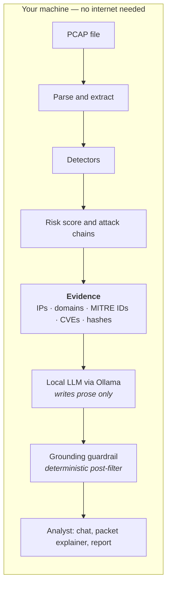
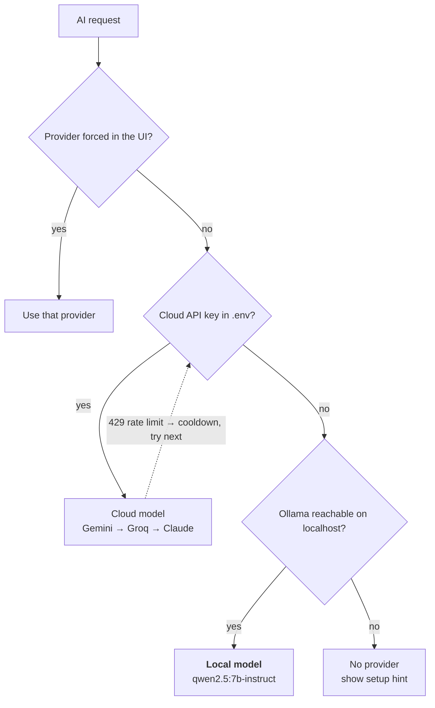
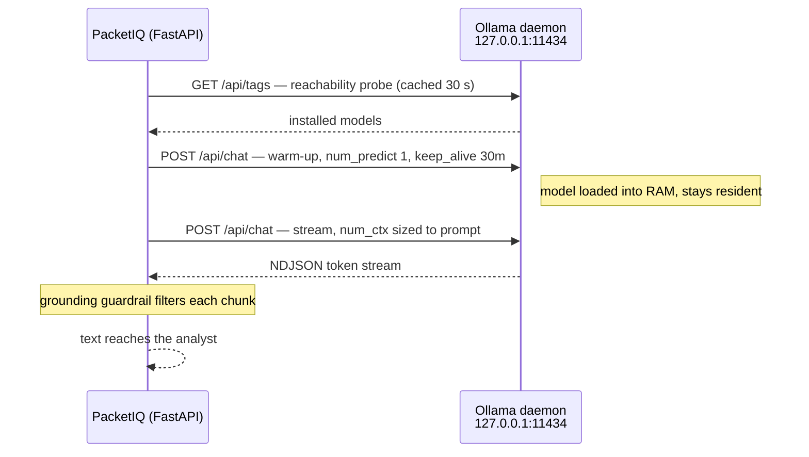

# Offline Local-LLM Integration (Ollama) in PacketIQ

How PacketIQ runs an AI SOC copilot with **no API key, no cloud provider and no
network egress** — and why its output can be trusted even though the local model
is small.

Every claim below is traceable to a named function in this repository. Functions are
cited by name rather than by line number so the references stay correct as the file
changes — `grep -n "def _stream_ai_raw" packetiq/webapp/app.py` locates any of them.

---

## 1. The design goal

A SOC analyst cannot paste a packet capture into a public chatbot: the capture is
evidence, and it frequently contains credentials, internal addressing and personal
data. A forensics tool that *requires* a cloud LLM is therefore unusable in the
environments that need it most.

PacketIQ's requirement was:

> The copilot must work with the machine unplugged from the internet, and its
> factual claims must be at least as trustworthy as a cloud model's.

Both halves are met. The first by running the model locally through Ollama; the
second by the **grounding guardrail** (§6), which is the more interesting result.

---

## 2. Where the LLM sits — it explains, it does not decide

This is the architectural point that matters most.



The detection engine is **entirely deterministic** — heuristics, threat-intel
snapshot lookups, JA3 fingerprints, YARA rules. The LLM is never consulted when
deciding *what was found*. It receives the finished evidence as read-only context
and produces natural language.

The whole language-model surface is three request handlers, all in
`packetiq/webapp/app.py` and all reaching the model through the single
`_stream_ai()` choke point:

| Feature | Handler |
|---|---|
| Explain a single packet | `packet_explain()` |
| AI-written incident report | `ai_report()` |
| Interactive chat (streamed) | `chat_endpoint()` |

Nothing in `packetiq/detection/`, `packetiq/correlation/` or the risk scorer
imports the copilot. **Removing the LLM entirely would not change a single
detection, risk score or attack chain.** That property is what makes the tool
defensible as a forensics instrument rather than an LLM demo.

---

## 3. Provider selection — local is the floor, not the fallback of last resort



Priority order lives in one table (`packetiq/webapp/app.py`, `_PROVIDER_SPECS`):

| Priority | Provider | Env var | Default model |
|--:|---|---|---|
| 1 | Gemini | `GEMINI_API_KEY` | `gemini-2.0-flash` |
| 2 | Groq | `GROQ_API_KEY` | `openai/gpt-oss-120b` |
| 3 | Anthropic | `ANTHROPIC_API_KEY` | `claude-sonnet-4-6` |
| 4 | **Ollama (local)** | *none needed* | `qwen2.5:7b-instruct` |

The cloud defaults are a starting point, not a catalogue, and they expire: Groq
retired `llama-3.3-70b-versatile` — the entry that sat in this table — and every
request for it came back 404. `_fetch_provider_models` asks each provider's own
models endpoint what the configured key can call, and `_model_for` prefers that
answer over any name compiled into the source. Ollama needs no such call: its
list is the daemon's installed models, probed locally on every status read.

Ollama is deliberately last: a cloud key wins when one is present. But it is the
only provider that is *always* available, needs no key, and has **no rate limit**
— so when a cloud provider returns HTTP 429, `_mark_cooldown()` benches it and the
chain falls through to the local model rather than failing.

Two failure modes are distinguished before any of that happens. Google grants
free-tier quota **per model and per project**, so a valid key can answer
`limit: 0` for `gemini-2.0-flash` while newer models reply normally — a
wrong-model problem, not a dead provider. PacketIQ marks that model unusable and
retries the same provider on its next candidate (`_MODEL_CANDIDATES`). Only when
every candidate is exhausted is the provider itself benched, and a quota that
will not recover soon (a per-day limit) is benched for an hour rather than for
the few seconds Google's misleading `retryDelay` suggests.

Ollama is "configured" when its daemon answers, not when a key exists:

```python
def _configured_providers() -> list:
    for n, envname, _ in _PROVIDER_SPECS:
        if n == "ollama":
            if _ollama_available():      # daemon reachable
                out.append(n)
        elif os.environ.get(envname) or env.get(envname):
            out.append(n)
```

---

## 4. The wire protocol — three calls, all to loopback



**The offline guarantee, stated precisely.** The web application constructs HTTP
requests itself in exactly three places, and all three target `_ollama_host()`:

| Function | Call | Purpose |
|---|---|---|
| `_ollama_probe()` | `httpx.get(host + "/api/tags")` | reachability + model list |
| `_ollama_warm()` | `httpx.post(host + "/api/chat")` | background warm-up |
| `_stream_ai_raw()` | `hc.stream("POST", host + "/api/chat")` | the actual completion |

`_ollama_host()` defaults to `http://localhost:11434`. The rest of the analysis
path is offline by construction: threat-intelligence feeds are **bundled dated
snapshots** (`packetiq/enrichment/data/`), and Chart.js and marked are **vendored**
into `packetiq/webapp/static/vendor/` rather than pulled from a CDN.

To be exact about what that does *not* say: the three cloud providers obviously do
reach the internet, but they never do so through hand-written HTTP — `_stream_ai_raw()`
hands off to the vendor SDKs (`google-genai`, `groq`, `anthropic`), and each branch is
reachable only when that provider's API key is configured. **With no cloud key set,
the copilot's only network destination is loopback.** That is the property worth
claiming, and it is the default state of a fresh install.

*(Optional integrations — Telegram alerts, MISP push, an NVD lookup that requires
its own API key — do reach the network, but only when you explicitly configure and
invoke them. The analysis pipeline itself never does.)*

---

## 5. Making a 7-billion-parameter model on a laptop feel fast

Generation, not parsing, dominates latency. Four changes, all in the Ollama branch
of `_stream_ai_raw()`:

| Lever | What it does | Why it matters |
|---|---|---|
| `keep_alive: 30m` | model stays resident between requests | Ollama's 5-minute default unloads the model, so an occasional query pays a multi-second cold reload |
| `num_ctx` sized to the prompt (cap 16384) | context window fits the evidence | the small default silently **truncates** a large PCAP context — an *accuracy* bug, not just a speed one. The context builder also caps long IP lists so evidence-rich captures stay signal-dense; see `reports/ollama_tuning.md` |
| `num_predict` per task | caps the reply length | a one-packet explanation asks for 900 tokens, not 2048 |
| background warm-up | preloads the model once | the *first* query no longer waits on a cold load |
| `seed` pinned (default 42) | fixes the sampler | Ollama seeds randomly, so the same capture was reworded on every run — a report an analyst cannot regenerate verbatim is hard to defend in evidence |

The warm-up only fires when Ollama is the provider that will actually serve the
request (`_ollama_should_warm()`), so a machine with a cloud key never loads a 7B
model into RAM for nothing.

Tunable via `OLLAMA_KEEP_ALIVE`, `OLLAMA_NUM_CTX`, `OLLAMA_MODEL`, `OLLAMA_HOST`,
`OLLAMA_SEED` (`random` restores sampling variety), and `PACKETIQ_ENABLE_OLLAMA=0`
to disable the provider entirely.

### 5b. Which model answers

The single biggest lever on local latency is *which model runs*, and until now
nothing let a user set it from the product. `_ollama_model()` fell through to
`models[0]` — whatever `/api/tags` happened to list first, which is ordered by
modification time. Pulling any new model therefore changed which model served the
copilot, silently; and on a machine with modest RAM that could be one several
times too large. An oversized model does not fail cleanly. It loads, swaps, and
answers minutes later.

Two changes:

**The user can choose.** `POST /api/ai/model {provider, model, persist}` pins a
model for any provider, applies immediately and writes `<PROVIDER>_MODEL` to
`.env`. An empty `model` clears the pin. The AI Copilot panel renders it as a
dropdown beside the provider selector, and the CLI exposes the same thing as
`packetiq chat|report --provider ollama --model <name>`. For Ollama the offered
list is the daemon's own installed list, with each model's real `size` and
`details.parameter_size` from `/api/tags` shown against this machine's physical
RAM — so the choice is made against numbers, not guesswork. A model that is not
pulled is refused with the `ollama pull` command that would fix it, rather than
being accepted and 404-ing on the first question.

**Automatic became deterministic.** With no pin: the tuned default if it is
installed *and* fits the RAM budget, else the largest installed model that fits,
else the smallest installed (ties broken by name, so two equal-size models cannot
trade places between runs). The budget is 60% of physical RAM — Ollama holds the
weights resident and adds a KV cache for the context window, while the OS and the
browser still need room. RAM is read from the OS (`sysconf` on Linux/macOS,
`GlobalMemoryStatusEx` on Windows), never guessed; when the platform will not say,
no fit claim is made anywhere in the UI and the automatic pick errs small.

Erring small is the deliberate part. An undersized model is less eloquent; the
grounding guardrail below means it is not less *accurate*, because the indicator
vocabulary is closed to the evidence either way.

---

## 6. The interesting result: a small local model that does not hallucinate

A 7B model is far weaker than a frontier cloud model, and left alone it *invents
indicators* — it pads a MITRE list or conjures a plausible CVE. In a forensics
report a single fabricated IP or CVE is worse than no answer at all.

**The insight:** PacketIQ already computes every indicator deterministically. So
the model's *indicator vocabulary can be closed to the evidence it was given.*
The guardrail (`_GroundingFilter`) is a streaming post-filter that extracts every
specific claim — IP addresses, `T####` technique IDs, CVE IDs, domains, file
hashes — and deletes any that does not appear in the evidence.

It can only ever **remove an invented entity, never add or alter a real one**, so a
faithful answer passes through byte-for-byte. It is deterministic, model-agnostic
and costs no extra inference.

### Measured (in `reports/`, reproducible)

Same capture (`datasets/real/pcaps/donbot.pcap`), same 5-question battery, scored
identically. *Faithfulness* = share of the model's specific claims that are
present in the evidence. Because the sampling seed is pinned, these runs
reproduce exactly.

| Configuration | Model | Faithfulness | Hallucinated claims |
|---|---|--:|--:|
| Local — guardrail **off** (raw) | `qwen2.5:7b-instruct` | 62.5% | 9 |
| Local — guardrail **on** (shipped) | `qwen2.5:7b-instruct` | **100.0%** | **0** |
| Cloud — Gemini (guardrail on) | `gemini-flash-lite-latest` | 100.0% | 0 |

The raw local model invented seven MITRE technique IDs and cited two RFC 5737
documentation addresses as observed hosts. The guardrail removed exactly those.

The effect is model-independent — a multi-model ablation over three local models
(`reports/faithfulness_ablation.md`) produced **47 hallucinated claims** in total
when raw, and **0** with the guardrail on, for every model:

| Local model | Raw faithfulness | Raw hallucinations | Guarded |
|---|--:|--:|--:|
| `qwen2.5:7b-instruct` | 62.5% | 9 | 100.0% / 0 |
| `llama3.1:8b` | 32.0% | 17 | 100.0% / 0 |
| `llama3.2:3b` | 0.0% | 21 | 100.0% / 0 |

Raw faithfulness falls sharply with model size, which is why `qwen2.5:7b-instruct`
is the default — that choice is measured, not assumed. What does *not* vary is the
guarded column.

**This is the contribution to state:** the guardrail lets a *small, offline* model
match a frontier cloud model on the only axis that matters for evidence — factual
grounding — with no cloud dependency at all.

**Choose the capture carefully when reproducing.** On the small built-in `--demo`
capture the raw local model already scores 100%, simply because there is little to
invent; the gap only opens on evidence-rich traffic. Measuring the guardrail on the
demo capture would understate it to zero.

Reproduce:

```bash
PCAP=datasets/real/pcaps/donbot.pcap
PACKETIQ_GROUNDING_GUARD=0 python tools/eval_copilot.py --pcap $PCAP --provider ollama  # raw
python tools/eval_copilot.py --pcap $PCAP --provider ollama                            # shipped
python tools/ablation.py --pcap $PCAP                                                  # multi-model
```

---

## 7. Running it

```bash
brew install ollama          # or: curl -fsSL https://ollama.com/install.sh | sh
ollama pull qwen2.5:7b-instruct
ollama serve
packetiq webapp              # copilot is live, offline, no key
```

The settings panel reports whether the daemon is reachable and which models are
installed, so a missing model is a visible state rather than a silent failure.

---

## 8. Limitations, stated honestly

- **The guarantee covers indicators, not prose.** The guardrail hard-guarantees
  that every IP, technique ID, CVE, domain and hash shown to the analyst appears
  in the evidence. It does **not** vet free-text claims — a model can still
  mischaracterise behaviour in a sentence containing no ungrounded indicator. Low
  temperature (0.15) and the prompt rules address that softer surface.
- **Grounding is not relational correctness.** The filter proves an indicator
  *appears in the evidence*, not that the model *related it correctly*. It removes
  fabrication, not misinterpretation.
- **Quality still tracks model size.** The local model's prose is measurably less
  fluent than a frontier model's. Grounding equalises factual safety, not writing.
- **The guardrail redacts; it does not repair.** A weaker model invents more, so
  more of its output is removed — `llama3.2:3b` reaches 100% guarded faithfulness
  partly by having 21 claims deleted. Guarded faithfulness is therefore a safety
  measure, not a quality measure; raw faithfulness is what model choice improves.
- **Reproducible, not deterministic in general.** Pinning `OLLAMA_SEED` makes runs
  repeatable on the *same* model, build and hardware. Changing any of those, or
  setting `OLLAMA_SEED=random`, reintroduces variation.
- **Throughput is hardware-bound.** No token-per-second figure is claimed here,
  because it depends entirely on the machine; the engineering in §5 removes the
  cold-start penalty rather than making the GPU faster.
- **`OLLAMA_HOST` can point elsewhere.** The offline property holds for the default
  loopback host. Pointing it at a remote Ollama server is possible, and would send
  evidence over the network.

See `docs/grounding_guardrail.md` for the formal treatment of the guardrail.
